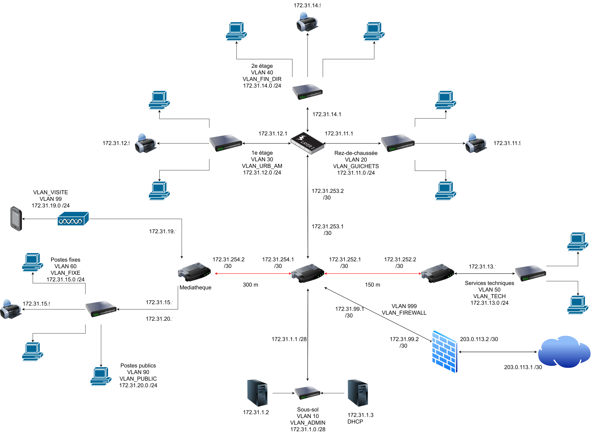
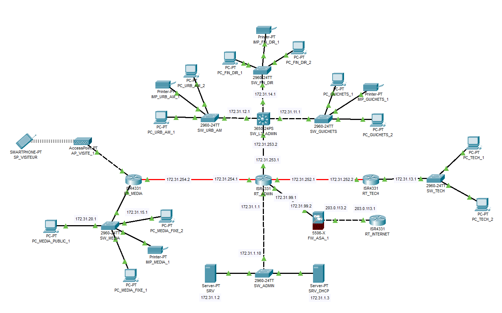

---
marp: false
theme: default
paginate: true
size: 16:9
backgroundColor: '#0f172a'
color: '#f8fafc'
style: |
  section {
    font-family: "Segoe UI", Arial, sans-serif;
    padding: 42px 58px 38px;
    border-top: 8px solid #2563eb;
    background: #0f172a;
    color: #f8fafc;
  }
  section.title {
    background: linear-gradient(135deg, #0f172a 0%, #1e293b 100%);
    color: #f8fafc;
    border-top-color: #38bdf8;
    padding: 90px 80px;
  }
  section.title h1 { font-size: 40px; color: #f8fafc; }
  section.full { padding: 10px; display: flex; justify-content: center; align-items: center; }
  section.full img { background: #f8fafc; border-radius: 8px; }
  section.title h2 { font-size: 23px; color: #94a3b8; font-weight: 400; }
  h1 { color: #f8fafc; font-size: 30px; margin-bottom: 8px; }
  h2 { color: #94a3b8; font-size: 18px; font-weight: 400; margin-top: 0; }
  h3 { color: #0f172a; font-size: 20px; margin: 4px 0 10px; }
  .tag { color: #38bdf8; border: 1px solid #38bdf8; border-radius: 18px; padding: 6px 14px; font-weight: 600; }
  .grid { display: grid; grid-template-columns: repeat(2, 1fr); gap: 18px; }
  .grid3 { display: grid; grid-template-columns: repeat(3, 1fr); gap: 16px; }
  .card { background: #1e293b; border: 1px solid #475569; border-radius: 12px; padding: 15px 18px; color: #e2e8f0; }
  .card h3 { color: #f8fafc; }
  .card code { color: #f9a8d4; }
  .card strong { color: #7dd3fc; }
  .note { background: #172554; border: 1px solid #2563eb; border-radius: 8px; padding: 10px 14px; color: #bfdbfe; }
  table { display: table; width: 100%; font-size: 16px; background: transparent; color: #e2e8f0; }
  tr { background: #1e293b !important; }
  tr:nth-child(2n) { background: #334155 !important; }
  th { background: #0f172a; color: white; }
  td { color: #e2e8f0; border-color: #475569; }
  code { color: #f9a8d4; }
  pre { background: #0f172a !important; color: #f8fafc; font-size: 13px; line-height: 1.25; }
---

<!-- _class: title -->
<!-- _backgroundColor: #0f172a -->
<!-- _color: #f8fafc -->

<span class="tag" style="color:#38bdf8;border-color:#38bdf8;">P_RES-129 · Cisco Packet Tracer</span>

<h1 style="color:#f8fafc;">Déploiement et sécurisation<br>d’une infrastructure réseau multi-sites</h1>

<h2 style="color:#cbd5e1;">Commune de Saint-Cosme — Présentation du projet</h2>

<br>

<div style="color:#f8fafc;">
<strong>Auteur :</strong> Petro Maltsev<br>
<strong>Outil de simulation :</strong> Cisco Packet Tracer<br>
<strong>Date :</strong> 05.10.2026
</div>

---

# Description du projet et exigences
## Trois bâtiments à interconnecter

| Bâtiment | Postes fixes | Postes publics | Imprimantes réseau | Bornes Wi-Fi | Distance |
|---|---:|---:|---:|---:|---:|
| Centre administratif (principal, 3 niveaux + sous-sol) | 70 | 0 | 4 | 0 | — |
| Médiathèque (secondaire) | 7 | 14 | 1 | 3 | 300 m |
| Services techniques (atelier) | 12 | 0 | 0 | 0 | 150 m |

<div class="note"><strong>Périmètre :</strong> un bâtiment principal et deux bâtiments secondaires, tous reliés au réseau du centre administratif.</div>

---

# Description du projet (suite)
## Détail du bâtiment principal : le Centre administratif

Les services de la commune sont répartis par étage. Chaque étage dispose d’un local de brassage relié au local IT du sous-sol.

| Niveau | Services et équipements | Postes fixes | Imprimantes |
|---|---|---:|---:|
| Sous-sol | Local IT : baie principale, 2 serveurs internes | — | — |
| Rez-de-chaussée | Guichets et service social | 28 | 2 |
| 1er étage | Urbanisme et aménagement | 20 | 1 |
| 2e étage | Finances et direction | 22 | 1 |

<div class="note"><strong>Exigence :</strong> les serveurs du sous-sol doivent être accessibles depuis tous les bâtiments ; chaque bâtiment secondaire dispose d’un local technique.</div>

---

<!-- _class: full -->



---

<!-- _class: full -->



---

# Plan d’adressage
## VLAN et liaisons WAN

<style scoped>
table { font-size: 13px; }
th, td { padding: 3px 8px; }
</style>

| Nom VLAN | N° VLAN | Adresse IP | Broadcast | CIDR | Masque | Passerelle | IPs réservées et statiques |
|---|---|---|---|---|---|---|---|
| VLAN_FIN_DIR | VLAN 40 | 172.31.14.0 | 172.31.14.255 | /24 | 255.255.255.0 | 172.31.14.1 | 172.31.14.9 (Imprimante) |
| VLAN_GUICHETS | VLAN 20 | 172.31.11.0 | 172.31.11.255 | /24 | 255.255.255.0 | 172.31.11.1 | 172.31.11.8 et 172.31.11.9 (Imprimante) |
| VLAN_URB_AM | VLAN 30 | 172.31.12.0 | 172.31.12.255 | /24 | 255.255.255.0 | 172.31.12.1 | 172.31.12.9 (Imprimante) |
| VLAN_ADMIN | VLAN 10 | 172.31.1.0 | 172.31.1.15 | /28 | 255.255.255.240 | 172.31.1.1 | 172.31.1.2 et 172.31.1.3 (Serveurs) |
| VLAN_VISITE | VLAN 99 | 172.31.19.0 | 172.31.19.255 | /24 | 255.255.255.0 | 172.31.19.1 | - |
| VLAN_TECH | VLAN 50 | 172.31.13.0 | 172.31.13.255 | /24 | 255.255.255.0 | 172.31.13.1 | - |
| VLAN_FIXE | VLAN 60 | 172.31.15.0 | 172.31.15.255 | /24 | 255.255.255.0 | 172.31.15.1 | 172.31.15.9 (Imprimante) |
| VLAN_PUBLIC | VLAN 90 | 172.31.20.0 | 172.31.20.255 | /24 | 255.255.255.0 | 172.31.20.1 | - |
| VLAN_FIREWALL | VLAN 999 | 172.31.99.0 | 172.31.99.3 | /30 | 255.255.255.252 | 172.31.99.1 | 172.31.99.1 et 172.31.99.2 |

| WAN : équipement A | WAN : équipement B | Adresse IP |
|---|---|---|
| RT_ADMIN | RT_MEDIA | 172.31.254.0 /30 |
| RT_ADMIN | RT_TECH | 172.31.252.0 /30 |
| RT_ADMIN | SW_L3_ADMIN | 172.31.253.0 /30 |
| FW_ASA_1 | RT_INTERNET | 203.0.113.0 /30 |

---

# Pools DHCP
## Serveur DHCP centralisé (`SRV_DHCP`)

| Pool Name | Default Gateway | DNS Server | Start IP Address | Subnet Mask | Max User |
|---|---|---|---|---|---:|
| Pool_Media_Public | 172.31.20.1 | 172.31.1.3 | 172.31.20.10 | 255.255.255.0 | 40 |
| Pool_Guichets | 172.31.11.1 | 172.31.1.3 | 172.31.11.10 | 255.255.255.0 | 40 |
| Pool_Fin_Dir | 172.31.14.1 | 172.31.1.3 | 172.31.14.10 | 255.255.255.0 | 40 |
| Pool_URB_AM | 172.31.12.1 | 172.31.1.3 | 172.31.12.10 | 255.255.255.0 | 40 |
| Pool_Tech | 172.31.13.1 | 172.31.1.3 | 172.31.13.10 | 255.255.255.0 | 40 |
| Pool_Media | 172.31.15.1 | 172.31.1.3 | 172.31.15.10 | 255.255.255.0 | 40 |

---

# DHCP du VLAN 99 sur RT_MEDIA
## Le Wi-Fi visiteurs est servi localement par le routeur

```text
ip dhcp excluded-address 172.31.19.1
!
ip dhcp pool Pool_Visiteur
 network 172.31.19.0 255.255.255.0
 default-router 172.31.19.1
 dns-server 172.31.1.2
```

<div class="note"><strong>Pool_Visiteur :</strong> réseau <code>172.31.19.0/24</code>, passerelle <code>172.31.19.1</code> exclue de la distribution, DNS <code>172.31.1.2</code>.</div>

---

# Configuration des switchs L2
## Commandes universelles pour tous les commutateurs d’accès L2

```text
interface FastEthernet0/1
 switchport trunk allowed vlan 10,20,30,40,50,60,90
 switchport mode trunk

interface range FastEthernet0/2 - 4
 switchport access vlan 40
 switchport mode access
```

<div class="note"><strong>Universel :</strong> la même structure s’applique à tous les switchs L2 ; seuls les VLAN autorisés sur le trunk et le VLAN d’accès changent selon le site.</div>

---

# Configuration du switch L3
## Interface VLAN, routage et route par défaut

<div class="grid">
<div class="card">

### Configuration L2

```text
interface Vlan20
    ip address 172.31.11.1 255.255.255.0
    ip helper-address 172.31.1.3

interface range GigabitEthernet1/0/2 - 4
    switchport trunk allowed vlan 10,20,30,40,50,60,90
    switchport mode trunk
```

</div>
<div class="card">

### Configuration L3

```text
interface GigabitEthernet1/0/1
    no switchport // active le port L3
    ip address 172.31.253.2 255.255.255.252


ip routing
ip route 0.0.0.0 0.0.0.0 172.31.253.1
```

</div>
</div>

---

# Configuration de RT_ADMIN
## Interface vers RT_MEDIA (fibre optique)

```text
interface GigabitEthernet0/0/0
 media-type sfp // utilise le port SFP (fibre) au lieu du cuivre
 ip address 172.31.254.1 255.255.255.252
 duplex auto // duplex négocié automatiquement
 speed auto // vitesse négociée automatiquement
```

```text
interface GigabitEthernet0/2/0
 switchport access vlan 10
 switchport trunk native vlan 10
 switchport trunk allowed vlan 1,10,20,30,40,50,60,90
 switchport mode access
```

<div class="note"><strong>Pourquoi des VLAN :</strong> le routeur dispose de peu de ports. Il est possible d’y ajouter des ports L2 issus de modules de switch, d’où le fonctionnement par VLAN.</div>

---

# Routage statique de RT_ADMIN
## Routeur central : il doit connaître tous les chemins

```text
ip route 172.31.11.0 255.255.255.0 172.31.253.2
ip route 172.31.14.0 255.255.255.0 172.31.253.2
ip route 172.31.12.0 255.255.255.0 172.31.253.2
ip route 172.31.13.0 255.255.255.0 172.31.252.2
ip route 172.31.15.0 255.255.255.0 172.31.254.2
ip route 172.31.20.0 255.255.255.0 172.31.254.2
ip route 172.31.19.0 255.255.255.0 172.31.254.2
ip route 0.0.0.0 0.0.0.0 172.31.99.2          // lié au firewall : sortie par défaut vers l’ASA
ip route 172.31.0.0 255.255.0.0 203.0.113.2   // lié au firewall : route des réseaux internes vers l’ASA
```

<div class="note"><strong>Rôle central :</strong> RT_ADMIN est au milieu de la topologie ; il doit connaître les chemins vers tous les réseaux (SW_L3_ADMIN, RT_TECH, RT_MEDIA et le firewall).</div>

---

# Sous-interfaces sur RT_MEDIA
## Deux VLAN sur un seul port : Router-on-a-Stick

```text
interface GigabitEthernet0/0/1.60
 encapsulation dot1Q 60
 ip address 172.31.15.1 255.255.255.0
 ip helper-address 172.31.1.3
```

| Commande | Explication |
|---|---|
| `GigabitEthernet0/0/1.60` | Sous-interface logique du port physique ; le `.60` rappelle le VLAN 60 |
| `encapsulation dot1Q 60` | Les trames portant le tag 802.1Q **VLAN 60** sont traitées par cette sous-interface |
| `ip address 172.31.15.1 …` | Passerelle du VLAN 60 (Médiathèque interne) |
| `ip helper-address 172.31.1.3` | Relais des requêtes DHCP vers `SRV_DHCP` |

<div class="note"><strong>Pourquoi :</strong> à la médiathèque, 2 VLAN (60 et 90) passent par 1 seul port physique ; chaque VLAN a donc sa sous-interface.</div>

---

# Isolation des visiteurs : sous-interface VLAN 99
## Utilisateurs externes : un VLAN dédié et filtré

```text
interface GigabitEthernet0/0/2.99
 encapsulation dot1Q 99 native
 ip address 172.31.19.1 255.255.255.0
 ip helper-address 172.31.1.3
 ip access-group ACL_VLAN99_RESTRICT in
```

| Commande | Explication |
|---|---|
| `interface GigabitEthernet0/0/2.99` | Sous-interface dédiée au Wi-Fi visiteurs : le trafic externe est séparé du reste du réseau |
| `encapsulation dot1Q 99 native` | Associe la sous-interface au VLAN 99 ; `native` = trames reçues sans tag |
| `ip address 172.31.19.1 255.255.255.0` | Passerelle du réseau visiteurs `172.31.19.0/24` |
| `ip helper-address 172.31.1.3` | Relais des requêtes DHCP vers `SRV_DHCP` |
| `ip access-group ACL_VLAN99_RESTRICT in` | Applique l’ACL au trafic **entrant** des visiteurs, avant tout routage |

<div class="note"><strong>Pourquoi :</strong> ce sont des utilisateurs externes, il faut les isoler. La sous-interface crée la frontière, l’ACL contrôle ce qui la traverse.</div>

---

# Isolation des visiteurs : ACL

<style scoped>
pre { font-size: 12px; }
table { font-size: 13px; }
th, td { padding: 3px 8px; }
</style>

```text
ip access-list extended ACL_VLAN99_RESTRICT
 permit udp 172.31.19.0 0.0.0.255 host 172.31.1.3 eq bootps
 permit ip 172.31.19.0 0.0.0.255 172.31.1.0 0.0.0.15
 deny ip any any
```

| Commande | Explication |
|---|---|
| `ip access-list extended ACL_VLAN99_RESTRICT` | Crée l’ACL étendue (source, destination, protocole) |
| `permit udp … host 172.31.1.3 eq bootps` | Autorise les requêtes DHCP (UDP 67) vers `SRV_DHCP` |
| `permit ip … 172.31.1.0 0.0.0.15` | Autorise les visiteurs vers le réseau serveurs `172.31.1.0/28` |
| `deny ip any any` | Bloque tout le reste |


---

# Pare-feu Cisco ASA : zones et routage
## `outside` et `inside` : deux zones de confiance différentes

<style scoped>
pre { font-size: 11px; line-height: 1.2; }
table { font-size: 12px; }
th, td { padding: 2px 8px; }
</style>

<div class="grid">

```text
interface GigabitEthernet1/1
 nameif outside
 security-level 0
 ip address 203.0.113.2 255.255.255.252
!
interface GigabitEthernet1/2
 nameif inside
 security-level 100
 ip address 172.31.99.2 255.255.255.252

object network NET_MEDIA
 subnet 172.31.15.0 255.255.255.0
 nat (inside,outside) dynamic interface
!
route outside 0.0.0.0 0.0.0.0 203.0.113.1 1
route inside 172.31.0.0 255.255.0.0 172.31.99.1 1
```

| Élément | Rôle |
|---|---|
| `outside`, niveau 0 | Côté Internet : zone non fiable, trafic entrant bloqué par défaut |
| `inside`, niveau 100 | Côté réseau communal : zone de confiance, peut sortir vers `outside` |
| `object network NET_MEDIA` + `nat` | PAT : le réseau médiathèque `172.31.15.0/24` sort avec l’IP de l’interface `outside` |
| `route outside 0.0.0.0 …` | Sortie par défaut vers l’opérateur `203.0.113.1` |
| `route inside 172.31.0.0/16 …` | Retour vers les réseaux internes via `RT_ADMIN` (`172.31.99.1`) |

</div>

---

# Pare-feu Cisco ASA : ACL et inspection

```text
access-list OUTSIDE_IN extended permit icmp any any echo-reply
access-list OUTSIDE_IN extended permit icmp any any unreachable
access-list OUTSIDE_IN extended permit icmp any any

policy-map global_policy
 class inspection_default
```

| Commande | Explication |
|---|---|
| `access-list OUTSIDE_IN … echo-reply` | Autorise les réponses de ping venant de `outside` |
| `access-list OUTSIDE_IN … unreachable` | Autorise les messages « destination inaccessible » (diagnostic) |
| `access-list OUTSIDE_IN … permit icmp any any` | Autorise tout l’ICMP depuis l’extérieur |
| `policy-map global_policy` | Politique globale appliquée au trafic traversant l’ASA |
| `class inspection_default` | Inspection d’état des protocoles standard : le trafic retour des connexions initiées à l’intérieur est accepté |

<div class="note"><strong>ACL OUTSIDE_IN :</strong> comme <code>outside</code> a le niveau 0, tout ce qui arrive de l’extérieur est refusé sauf ce que l’ACL autorise ; ici uniquement l’ICMP, pour valider les tests de connectivité.</div>

---

# Simulation d’Internet : RT_INTERNET
## Une loopback pour représenter un serveur public

```text
interface Loopback1
 ip address 8.8.8.8 255.255.255.255
!
interface GigabitEthernet0/0/0
 ip address 203.0.113.1 255.255.255.252
 duplex auto
 speed auto

ip route 172.31.0.0 255.255.0.0 203.0.113.2
```

| Commande | Explication |
|---|---|
| `interface Loopback1` | Interface virtuelle, toujours active : elle simule un serveur sur Internet |
| `ip address 8.8.8.8 255.255.255.255` | Adresse publique (type DNS Google) en `/32` : cible de test pour la sortie Internet |
| `GigabitEthernet0/0/0` — `203.0.113.1/30` | Lien vers l’ASA (`203.0.113.2`) : côté opérateur |
| `duplex auto` / `speed auto` | Négociation automatique du lien |
| `ip route 172.31.0.0 255.255.0.0 203.0.113.2` | Route de retour vers tous les réseaux de la commune, via l’ASA |

<div class="note"><strong>Objectif :</strong> pas d’Internet réel dans Packet Tracer ; la loopback <code>8.8.8.8</code> permet de tester un ping vers l’extérieur et de valider NAT et pare-feu.</div>

---

# Validation des tests : connectivité et routage WAN
## Vérification des flux ICMP vers l’opérateur (`RT_INTERNET`)

<div style="text-align: center; margin: 10px auto 15px;">

!['w:860'](data:image/png;base64,iVBORw0KGgoAAAANSUhEUgAAAwsAAAB8CAYAAAAmaSxeAAAQAElEQVR4Aex9D5hrR3Xf7zqQUgfykdRA4ho7DdLipygtiUuIJbsNJU3QbkLe5xfUEOwsaWDXhMDKid9XylvqlCwl6ZpYC21qLaZkYxc+ltgsJG9lwA7/LBGnL04C8j5nJUPtOPwxDo4fBoPBqOfMvXM1urpzdbX6rz376ejeO3PmzJnfmX9nZq72rKc99+ebQoKB1AGpA1IHpA5IHZA6IHVgsurAH37g480X/e9PNJ3VmxX9yNs+0nz4sceb/f6xDJal5TqrdzZ3ldAzzeve7ublx739dLOu4prN+sc+ovRwVj/SXLr7jB/O0fW7Tzcznp46nsObzTPNXUqX+dgZ9bi7zfLv9PJ7oLmk02y38mk+yLICPNsPqPRuHMnQeileevbLYMjsqiena9HP/OEnmze8/6NN3Q623vfh5s8tnvCff/O//q+mpjeuv6v5Dw+fcXWK8f2VfzzTvOatW356lqPz4etr/oyF/F3zbZeZdfB1zbd9lsL/7K2uDpe9r9loejzmvZ7Ldw17a/NWEtd4x+tcec/15IfJfP2fE6eb11mQP0FAEJghBKQogoAgIAgIArOCwN/89d34xec+yy/O3oNn8L/+4rP49neaflivN5z2f955L1hWK+0DWHjjLTjrjR/Bb36pFaruvrSHORV3C+ZuO6OCgDN4x3s+4oefRfFz79nDp7xYHc/hLHOB0n3qto+Q/Fuw8Glm0vndiXfwI9OnW/mc9TaWFeD59J0qvRtHCbReipeeEeDnoK56Kib/66UX/gD+5q67/ee/vruBX/jZrP/81v9yJTR9h2zwxBPf8eO63Xzxyw/j6d/7VD89yzHT/NGrX4IX3gC89uYP4sw9mjYwf/sKvvfVHzNZ+7j/GF567I+BV254eWxgbvP38aEwie9/M37jo+cpfcRZCANIwgQBQUAQEAQEgUlAQHQ41Ajs3FrFs/9JOwRv+fjf4mOf+3J7YA9PH6W0v/eJ/R5SHB7W8767iQ98qOIXeOdDVZz3A+f4z1E33/r2E6CleJ+lV2eCE/7ltb+O773wJW30Y9d+jqNcuvuP8GMX/jpOsD9j3ruxQJwwxdPK46XvJwfCIpMdGNZHnAUNsFwFAUFAEBAEBAFBQBCYIAQe+sojuO3WT+IPfu5f+Vo9+vi38Uvv/Qvcdu+DPe0w8I7CRyjNyygty/AFyo1CYPMlz8PJP/kzPPzIo+qZvxj/D3/iFH7/mlfzYyS967234rP3f8Hnue2Tf4lP3PkZ/1nfTONVnIVptJroLAgIAoKAICAICAKHAoF33vgBPPcpwIt++Jl+eb/y2OO47N1/jv/+yX384ze+RSvaflTHTbMJxfN7n/xbHKM0nLaD6ZAH/GziWbjgu57A1rtPdiBxw3vKSPzQufipi/8VHvvG4z79WDoBx4H//EPnPQtPftKT/Ofve/rT8P1Pf6r//D3/9Ck4kjjff2ZZHZlNaIA4CxNqGFFrEhAQHQQBQUAQEAQEgfEj8CuveiNOXnExeFKrteHdgdXb7sYl7/g4/vsd+6j/w6N4/Inv4Ak+S0/E9xzGcczzxtv2wGl0erm2ENj55Z/Er7xytRUQuLti5Xfxx5vX4LfedD0ufslrFb3lf7wH//5l/0ndc9h//t134uivXeM/X/n6Iv7jb13rP3PcG37vnf4zpwlkM7GP4ixMrGlEMUFAEBAEBIGBIiDCBIEpReCRM4/i2PKbcO2LnovSL/x4Wyn4ReX//OEanlv8MJ7y2zt48jXvV8T3HMZxzNOWSB4UAux8PfZffgGvf8s78LWvP6bCwr4eOfM1HHvVb+M3fvUXUHjlZeq40f5nH8C9931e3fPxo/rn/h6N//f3bc8cxnFMHGc+c1hYXpMYJs7CJFpFdBIEBAFBQBAQBAQBQcBA4OOVv8LFP/1r+Ks7/woPveHn8C++73uM2MN520+pN1/yPPzmjz4TP/SCX8Y7373bVdTH//zT+Mmffy3uqjVw353/Bxec96yuaWaFQZyFWbGklEMQEAQEAUFAEBAEZhyBJm56+7vwvJ99Nd7ygvNQWvhR/LsffgbmznkqnvrdT5rxsh+8eD/4tKfgonOfjn//nGdh8+f+JXYv+1H8Tfk2HPvl34rcUQjL8Q+3P4Tn/cyVuOaqK7Dxptfg3/7kv0Tih/45vufsp4Sxz0SYOAszYcZpKIToKAgIAoKAICAICAKDQOAfH/wyXvua30at/GFc/v3fwZ8cex4+f/zF+M7vXCYUgsFfvupSbP50EvmnfwufPvkhLF95Dbbe/acHNsXDj3wVrznxdvw17TL84sK/wfb1q2jc8Ufe/y744MxdxVk4cFWRhIKAICAIHGIEpOiCgCAwVgQe+8Y38a73fgiv+09vxUU//Uqc+7xfbPt9fv59fCH3/wnMXfxy/Nuffw2uev3vg3cGzJ9HPagRFf60y/DaN/4P/PiLX40f/PH8zOJ/Vuu/xM2eJyRlE5tKHZA6IHVA6oDUAakDUge61wHBSDCy1QHrzsLv/O4GhAQDqQNSB6QOSB2QOiB1QOqA1AGpA4e3DlidBd6WeePrVzDL9Gu/8tIpLd9w7SK4DBffbm1K8B8v/t3sc9D4SbTrJOrE+E6qXqzbKGgWyz+JZRKdZrOvHUUbPWx5RDoL7DAICQKCgCAgCAwZAREvCAgCgoAgIAhMKALiLEyoYUQtQUAQEAQEAUFAEJhOBERrQWCWEBBnYZasKWURBAQBQUAQEAQEAUFAEBAEBoiAOAsYIJoiShAQBAQBQUAQEAQEAUFAEJghBMRZmCFjSlEEAUEAgIAgCAgCgoAgIAgIAgNDQJyFgUEpggQBQUAQEAQEAUFg0AiIPEFAEBgvAr05C40NZB0HjtOi7EYD4PDsBuhuvKUZRO4DK0sZyzZMysttGC6XteIRaTQL4vD4zIO9seo92GxEWggCAewdJwtueiGcMYKMOnTg+j4IGTFUnWUWxt7oSx1H96v92HZQgDWwkdX6OGj1URb5XJbsEMcAlu/j09JLtYPbaVwaQN6NjSzUeGYpYu/BRhvpPXFnig4MeqwnnD42Tq79ld17StepdmQIy27ryzjfHssVmcEBImP1tayn1y64DArXAdvbVD2WTmYCuvf1ovvQzxD1Dc1PAqcZgd6cBS5ppoh6s4mmR5WVBJBYQaWyggSYQUgh0NhHTd0EvrgBzwO7Hn7NehG1ea9ztKUxRcThMfkHdR+l96DyEDnRCCzt+u2uWc9jO7lMrmN0ktBYsw4dtO0OQkaococokLH3+oF6MYNMse7ZtwLuVseHBE+EktjOa312Ad1HjUupKKxeNIDxh/q3xb1VqPFsYGXMobS6h8WDe/Wdmpjj724ahcUeHDTG8CDj9EHTdWpvCamisO6vmFl4Rhxs9rXNLu1R42P2icNQ19Spn/5f6zZsfXU+cp0JBHp3FsKKTR1tlj1rdV2mFXVe+fEmMqZHrJYpwgRMRxivPDkOl43ILwsPrPTshbsrUxS2WEC1WkCScQkWL5NCUodxR6M6o840nfkFeBTeerCguKzndNAez0Y2qJPOsI9rqN6uPFNXFwMKt+mnwgP1hMM8DB3HqzskAjNUf7g4AyOqN6tLm9jRY2woTlwngvWAwsy6ybhnqQ7xdZlsom2w7AkmhU3bOircIiPA21YPlsNlUxL5BBAoLzvtK9xl2olcJnuwjbKEY9azKYfptMwTYjsd3dO1cRLbKGLL91hyOF5fxQLcP7M++DZ2o9R3aHyb7kb7Vin6/FKyvTps4JPdKPu7I76eFpzK69vIH895ilD91hgTpn5ajrWkV7vrxOs4bBujfLnjyG+vH8yp5/yiKJlCRseH6aVw0fWFdFLPGzQ68GGArL+7bZbPt112HXtatpHOWk7Ne5Brpogi1jp3Ss18SeuNbNblUeG6XNxWyp12xnD+7PisYtXsV4eTfUtqrP6/xd45jlIdD+obVocMEXJ7uBHo3VngCbDqEKlTzG5QEw4AWK0htcU7DyXkuFGvpfydiF3Md9/ODoibmEcqy+J23ivLLpY2d9wBoLyOQlqv+O4iXeCBIYGVrSIy1AnWgys53MjT5EQoDKkD9wsYSBOaX4DHTxu4CdUpwNPro1VvEsS6FtLebgljsOh26hRl/Zj1hJBcTtJgXed600S9WMM8T4RIbnZW6o8ViINHJFMZ1PYbPPIjFKfQehBRhzaBo2ql26jfZIPOem+Rwby2ehAm++BFn+mUueNF0FIrtQouJg3qa5tYOupNZP12U0ex5vWnhHuo/Tn5Qai+h2p6DrRn7KdOJHJIcADltWizMXNHxfu609jAvMMgnQft2KKwBvBYxPfbJ9Eg3cJxKmNnM405Lh/rFNpuKCIifWj/RUlo2x0L+Rp8p16FDeiL7cSirHpRpMaj2cKcJ/yhNiQ5fvhWCrUqpW/7lGEvZxtjzw8Lx2mntJfdBV2uOreVtXY795x7SILNed+ZcvQ8JxKfZ+AVtjE/RPwggrr2/zoT0ruz3gf68FAeLUCuggDQu7PAE2A1oaCJXXAizIhm8ljQnS53ZlU9MXYwTxMGNblhvmkjmixXtoBFNcmfxyZq4HkakrS6ozuWZaBkdsqWMuZKhJ3C8Ch2lDzTaYD7Z8vPjY3+PoBO0QLdWKvebOelo8gpthyOLlWxV1cP9i+znvB2qPGcWKmgWSJpLHdW6o8dif5jbDj1Wg/8naMkUhmvfvdSD1kPWz0Ik91/yWdTQmIB+Yy3a+St8vuL3n47SdAkNOM6i4z7qNoJ52WzMVsjKt7XnRmHRGYe5j1nx7qF4aT6n1Rrt9fWbiLTt8Y9v//iPD0a2Lhn6O/M11DcWkHCphfnHcSAw5g/xIaNk9tA8bjbj1O7X11iZoMUTtHlNLh7u+X8ELK7YJNilsu8t/H3Gr6kFwBprPbmOV3x6TWPQfGzPY160THP6hbPesThYT6hSURgJDr17iz0qpbZ6GiCPNgzob0q0wc/b9El97BKZWg2aeVVi6JOrsJhddpJ8JwGXhTX0dHXHDkX7kr6WvBcqy0/q8A69qpeZF86eTIiLxF6W9MZ+ll5QiJmpf6EFK3foDoZPK2XQ8NwGkQ96Lke9lsqSc+r0Ss0U9uk5Wg1QckvINENljD7d0tji+fJcm2/c9fYxj9N4XFwimo3cdIPE4+M+c6gcZZ+3HoNoMw5tbtw0iLpgOOHRdosBHft/81CxqkfcXhMmXJ/qBAYrrPAg86mXi2g7fSs9+sB0wrxkrd6Xt6hnQW3EOoMI3sH3gCzuwREriLx5Ms8k09D8sntKvxJnyvW/V7qzM+NML6re6jzI6/68JWoZ50oTddPlN7Kzt6xLPCWfgappCcxRD8vpnVJzCFd3cbJhhfEeWU30FByZ6j+eMUbyIW2jdc2l6BOp1hwGlg9iFMPuVBKD0s94Hih+AjkjmKJ+s7F7TRW/XcHKLnfThrw+w2F+wDbCe9soGC8mFvGMu2AZnlBQ+UVYeNu8RjjJS2IAAAAEABJREFUn9ItBCfV/3j9KKlnbTeR6UP6L5LFn7ZJHQcMmmx62fJR/J02TCzk0Tr+xv14QIDCyV7OAHfvjzSGrqKAgl70Av3FGT+IbRSfrviMQgmdR4z+X7O6px9C6r3PQDeqTnThITb5HF4EhussUOOv8C82JB04TlKd7efTJRMPd7V1dMpxSHd2BtTg7Z1j3AGW4B614S3nXXjhxDtf814MVB0ryeFJr1ngXMk9k0+8jkOyCRf+1RGFi5nGkh9MHsKXX3KdZzmLe0hn3IysOrnRB/uO1HsFW/yeAevhzAO73oqXRb9OBXIo1fPYVvWEMFEiaHud0k9l/eks4GBCvJ0rxyGMkvyOh3cO2YKTtR6YdaibZnHqoZZBeoTWAx0v1x4QyIFfXaimvQUDnTKTxt4i2Z/6DX5Xyu03VjDYdpLASoXfPUpSv815zaNWrLu/FNTNxt3idTnGcSXdwnHio5M191gp6WVvN504K/xh6b9IFmgxaL/mOfXqeQhf1nJZ8iL+0HbaFr6GmjeetKRElbPF1c9djiq9ny3pEza+9SM/dlqzr6X+lqcA/KuPLdxC8OmlX42tiMFo6hSj//dTEo6h9d7U18bjC5Gbw45Ab84CVyjv/F4bcDpcX81ImmTqn1lV59DNuEm85zLwsSKT1IhAHaUOK5XU8aFSzi1A6yx/63wjeABh/hC8eDDyMSGe1tEsLw+Vxrun+GbJzM8LVzyUi37/oUI8FW+STmqF60QRfXzseoP60Yr3s49NlDxcOCtfD1M/xtjTn3kUcRiXVZE3CeaIaas/rPMwyMRBYdSytcrOjDcM4OPPaXzMjTrEuHO4viphPFnU8j1eTl+iOkbXkrKvFx5Ia9YRl48EWmVTnHwUAoxbqx/gIN45AIr+ywocxpTC8Qr1M2SHtv7UYn9OcTDy7Mv5EJm6sa66/wqzcbf4g+nTSsXyTX2o84H66W6zntnuLTjl1BGYsp9JeLuhaEt6pQPh5OJi9F/ldWznvfcAKHlfH7NMQUFhegX5jWfG0NW1vb9uhVdQoXqm7Guks5YzqE/cZ1M2p+Fn9euA/GAZ35inQotJzGK757iDkomlZ1OFA8mLxsdrM1o34h/Yp0Mn3T97OZjxLWXJhh5OYfHBOUoojyf/8FykpBYEenMWLEIkWBAQBAQBQWBACPAxPId3YlfH/P8WBlSeaRBDk86t1BrUUauB6VvG8lrK+AnagQkWQYKAICAIjBQBcRZGCrdkNjAERJAgMKsI6BU+vUKoy0kTWrWCrp/lOlAEeNW4bceib+m00jyMVea+9RIBgoAgIAj0hoA4C73hJdyCgCAgCAgCQ0BARAoCgoAgIAhMJgLiLEymXUQrQUAQEAQEAUFAEBAEphUB0XuGEBBnYYaMKUURBAQBQUAQEAQEAUFAEBAEBomAOAuDRHNaZYnegoAgIAgIAoKAICAICAKCQAgCh9pZOPfcc0MgkSDBZbx1QPAfL/7Dyn2Udo1bhknUiXWfVL1Yt1HQLJZ/EsskOo2iNkses4DAoXYWZsGAUgZBQBAQBAQBQUAQmGkEpHCCwFgREGdhrPBL5oKAICAICAKCgCAgCAgCgsDkIiDOQhzbqH+S5MBxXFL/+t2WbuzhDWxku+jZ2EA2u4HGMHRl2R5OjsN6ZLHhZ9TSzXEcdMWxQ5bj/tMkDmf9+eoE5ZvPIQUM2NIx07M8Xy7rblBXZXVeZSw7yyjrx0m/cpnJFo4TKGtYuOKJwJfT+PiZfGx3er6d6p2SYeSlninunct++3IcjqcwrjcsUz1zmEfaFirO41M4e/lwujA7R+XPaZSMMX5xeRg/pQKXxSsvlV8XGcxjPhNvYyNL2Hl1zot3HJ3WxIeYu3ze89wfwUGpi+jxRxt1wsczqJWNp9fwoNxJe1b1xKwbXN/M50lT2NPHZgcvehgXbl/x/1kf4XjJWe7Yxhir9kxjgrqyduY9PwsNE4Fw25GNsu78o2nL3LedjSGOHcu48pKN4cyzbGoNMVychW7gcqWZB3abTTSZ6kXU5ie4U22cxDaKqJOuwf/phFH9Zdz8FV67aRQWucFwA01iO193cWzuAnFwNGVRmTr/aVIVhfUep+ZLu54OZNN6HttJb6Jl4tOW7y6WNtcMp8dkNO+pA3HmsWkGTcN9WFmxggrhzTasFzPIFLXdKjH/q3CIXS6IkMmvD5l2aRr5hOnnT+5D8tGYB+W9KCL/hE7UeR19SJe2ksmgtqPrfAMntwEKaqlp4uW3v1b04byjtjlfQ7HObZ778JA2Ty7+ciiPLa0tfFoQjmg7E1mEMeBN4//i3io6x50YAOl/otjYR81nz6G0uofF1gqaHyM3A0agH9t1U6XNpjbmHK4/cXpmbD0xzsI999yDS57/fBwjerlHfM9hHGczx0jCMykkdUbcAeiJDFXG1go9D/CGE8Fx/uqeMTDZwo0VE8df9mKZeoXQcVfVlR62cOpMkwVUqwUkeXWb88ryRJ0TcRpDPw4aBSVTyHA+nhOztaJnZTkcr69igeP6oUwRRcSZyCP8j+y5urQJf+4VypXD0aUq9uqhkV4g47uDo+QELXkh03mJU9YYJevXLtYsAvoNLR+rAsOP6NpW8sin9r0Vqzr20vRs00q3P1v8YQnnwT2TxwJ3P4kF5DM17PsOpweCjafXcE/cxF+mre3Y7NA70LFTlNe3kT+ea/GHjtOgDT/e3aOxOruOPVpkUQnU+LuK1UVvTNZjce448tvr5JoqLvkaEgJB2/Eug+N4NjLztNjUZ+mIp7E+aNMOHi917uqZsfVYnYWHHnoIx44dw5PIgG84cgSbp07hvUQ3EP0B0TrRJUQ/RXGpVAp33XUXOI1nhtFceDKZ5sk3VTKegMfKlSft1MnwKhZ1HPViDfPKAbCEc6eyllK7AbySu4t5dxuzvI5CWq+C7yJd8DoYWzhyKNWLtMrIK/sleoql7HCZ6nuocg58Tc+Bx2p+ZEokckiYARwYpKrGnvDXnW2AZ+E47Q70urtgyEimaKW2Y+ZgMFC3vrOZQSpphgXvE1ipTAjmQdV6ei6je1njCezZLpvzcByyM5PF1gixhTWfWPLilWWkXDHayhz2cJInu+Ud1FJzdvVYlj328MQwDn7/k8BcOsT5t/H0Gj5FqFrbziSWwWaHoenKfWEac3qMso3TFL5YSEOdPthK4e5POYZGz8ArtrwxubICV1QCC/kaoheoDBFyewAEOm1n2qhW9USS7bJhcy8vmrxAdMbTWG/aNFLG7Nh6bM4CT/qvuuoq3HLLLbiIDFMiOo/oW0TfJHqY6FGiFxMtE917+jQuuugicBpOS0Ej++RKtHVNk/5m8yh2eCLTzWkwV0AAJFYqaPKZIFs4d4LV1qR4fhOo8eSVVwX1hIdAKDW9yagtnPKaiI9RFoe39bd0J3kA7Wj1i49UsRPV9DvbgBx26NDH7kJAnHo0y+DMo1bcinn8RqWerq9hlbVXuyxpx5jam2nrbvrZ8rHJmy7rhGqbnIPa6aIuBfmFZDuPiVe/7a9dsjzNGgJ+22nOWsn6Lw81rpp5qsAyTjf4HGDxuLs4R3ieiLm1rMb4/rUUCWEIBGwXtNGqtlH9tHcSw1ELVf7cS8u02FxHq2sMnlmw9dichfvvvx833XSTwvoF9P0Y0deJvkb0DaJvEz1BxAr+BF3PJuIPp7nvvvv4dgxEK/fkNPBOwVrHmcM69qp9qGRObCiPCh/XoY5HnRvn3QLPaVAbFLbwyOz71C9SdiDSnODrI1vs4NT2vaMTAf4BPObU7sLJA0mqk+HS/vKRJ8Ivwy6WkKEJmbsm5MXO1mWIZQ3a5UDAxdBvIPkcSLkhJIrTVnJHgZ0N9b5CsOrCx4ucLt3+hqDmVIlsw7SB/VrITqGNp9fwqQIG4LbzvvXdydfaZodRah42To8yf8lr8Ah0s2m3eNYoDg/zTTHxXHws6l9++eV+vh+jO3YS2Dl4lO6Z2HngHQbeafgchX2VSH+uuOIKfTv8qzqLZrxzQNPdk9tV+JPL6h7qrAV7snxlSswhXd12jwnwM8vgYxW2cO4E/RdoG+rXjNgpUGfs+MZzDnbJG2YP1RbOWXVQmH4dTCMI4HPCKBgv+5SxTLs08X9lAtF/hNEqCij06rDRFuLa5hKO5mD5IwexnkfoS9CWFNMbPISyHtQuoSBG6DfQfEIzH11grLaSRArb2E4fdVc0R6fddOZk9r38TkjVOF6iS2Tj6TVcy5uWK7WdE85VvfedbvlG922zw7A0UPl54zvnYRmnEwt5QB8RRhkf2GTmaApdoIpOIrG9IBCwXdBGO9pGySPIhMy9/KwsNvfj+aYLz6zYemzOwunTpxlmRQ/QNx9Depiu7BQ8RNcvE32J6B6iG4jYkaDL6D+5Eur8zoHjblM5jvuLPnyqCNTJ8sux8xy3uId0RqunJzVemnlgVx2rsISTnAr/akmS+ZPqPQWWz8eX+P0Fx+FwB/O1IvgFYVu4zt2/ktxw/XyOEd4ksFLh9y6SarvPUUd76gf7lQmL1rnjRfgmsPCoYG+XxnEI1yS/W+Id71KRIV8aR3b4QqJnKmgIZT2QXcg27Cd3YBuhX0c+pp1t8joymISAOG0lgYUU6Rr9Ig0xyMdFgPpe3ccmC0jv6jbPixZ6McjG02u4m+M0feeuvi5e3znWQtnsMCyl+McUaq0X4anvCRuneR6w5c8R1vCZi5vtCqmJawFJf/xoYL8WtUDVnlyeDoJAp+1MG9HGoivUZlM3ls+QI9zmc7Qg7Nk0UsY02loXvv06Nmfhsssu8zV5Mt3dTnQN0Y1Ef+rRB+n6fiI+kkQX/3PjjczlPw79hifn6sx8k7f1m20TXP99hkoJpYrxc49cgTz+pn7XgDW1hZNT4ufBngLzEvnyWZZyOCiQPrZw7rgqYXymfqyDwUPiBveJlJ1DicvhkTpqFZWzTZYO11ctg5+7HbswcVZ6BGzGuLAcvmq5dFV4B8IoOOTDZSxNz2pvjLJy/e9qK0ZCy9JXDmPi54BdOmR22KUJ1Qw4bQB33xbBOH7W+djksT5EHflT2Ng/rL9fVq5Hbn/D/YKPv8HTKgM7F16dM+LHXp5JU8CoE6puKf0YZw87fg7loYhewynJRH+C9YSfdduZZMVtdhiSznxEa9v88Qwjf/Ueopcvt0Vup03CsFIJ9l1cx6gtV7x398rr2M577zh46eUyeASCtguzkcPZhtmU24O2V1g8jfBqLhPJQ8LL186MrcfmLJw4cYKQdD8P0uUrRGeIeDeBn/U97zB8gcL1h48vXXDBBfpRrtOOQGMDWVr1dRzH23HQ12yM/2tgKfwwZHJWw5LLsg9AY0kiGIwFdslUEBAExoAATRq3UmsY2HFZ0E7WWkqdEBhDaQ5XlgO3Xa/wlXHlm4/MjK3H5ixceOGFMB2Gz5MdPkFUJuKdBX5V9Q66rxGxI0EX8G7Eddddh3POOYcfhWYBAWrQ6iVutWybiF4AABAASURBVMpPqy/+tXLwXx8ahkzGelhyWfa0kGAwLZYSPacPAdF4AhHgFWl/Z69v/WiXQa9G9y1LBHRDYLC265ZbMD6H6+/wdpOCUVP4PDZn4eyzz8ba2hp46453C44cOYLHCUC9k/BFun+E6Nm0i8A/mco8N998szgKhIl8BAFBQBAQBAQBQUAQEAQmGYHZ0W1szoIJIb+DcOutt2JpaamDOO7UqVPgq5lG7gUBQUAQEAQEAUFAEBAEBAFBYLgITISzwEU8//zzUSqVOujSSy/laCFBYKgIiHBBQBAQBAQBQUAQEAQEgU4EJsZZ6FRNQgQBQUAQEAQEgQMhIIkEAUFAEBAEBoSAOAsDAlLECAKCgCAw7Qi87G/vxkFp2ssu+gsCgsAkIyC6jRMBcRbGib7kLQgIAoKAICAICAKCgCAgCEwwAuIsTLBxplU10VsQEAQEAUFAEBAEBAFBYDYQEGdhNuwopRAEBAFBYFgIiFxBQBAQBASBQ4yAOAuH2PhSdEFAEBAEBAFBQBA4bAhIeQWB3hAQZyEOXuVlOI7j03I5TqJx8TSwkXV1terZ2EA2u4FGLypyGgMDx8liwxfQytNxHFjz1fl5sky+xkaW8F2GgjaAt5+XLZzlssxAmcrLDrItJZnLTpyedHccFzs/Tw435ZrPfO/zu+nMMtkzm6CYkDI4XIiwcFVW0+6BcnAaxoqvHfWD0t1O9U7JcLFyHH2luHe2t7E2/H0+j5/146xt+XC9LIfIi8qf07DMcRKXh/FTOljaFPMQHhoCZm1rO16843hYtdmBuaNpufwOar8Ho2jJExBr1AkTvzbNbDy9hrcJncAHVU+o3fn1nuub+TyBOvsqlbHseGOFHza8G25fsccRGlU3LjmL2hDpwxir9kz6qiuFwbznZ6FhIhBuO67r7jylacvct52NIY4dy7jykg2qETYZ0xUuzkI3e3GlmQd2m03136ab9SJq86PrVLup1xHfOIltFFEnfUs5DPYv48ptkuzmbhqFRW4I3PCS2M7XXXyau0AcfDIZ1HaUa0A6NnByG6Aguvc+S7uePMa9gpVESHg9j+2kZdAgu62hiPz2OnXPiPcXWr4uSc00ccveReTIowNlWNpcwwZWUGE7E9WLGWSK2r6GLSIVraKwru3rMV4QIfNc4rHZPEw/f5ITkg+JUp+gvBdF5K/rl0o47q8ubYoaSmTbMfHy2+m4yzTu/Glwn6+hWKf+RPXhYf2GjafX8HGXNW7+EW0nroiR85EtnHlsjipfGkcW91ZR8QegHjJOUH9TWUGisY+anyyH0uoeFuMuYvnp5KZnBPqxXbfM2mxqY87h+hOnZ8bWE+Ms3HPPPbjk+c/HMaKXe8T3HMZxNnOMJDyTQlJnxB1A05swUWVsrdDzAG84ERznr+4ZA5Mt3Fi5Uiu7Kj+WqVcIHWOV3BZOHWmygGq1gCSvvHBe/ooGpzH0U/L7+EqmkOHknnOy5XemORyvr2KB4yIpj3xq3/O669hL03Mkf0gk2WJ1aRO+z2GwlNcLSB9dwUK+FhpvsIbf6vKFx9pDM3ksTNTE065qeEwOR5eq2KuHx8YOzRRRBDkd/qQeA/oL6De0fAakbqeY7iFd2xS1lbht56D1uLuW08XBg7tum4kF5DM17Afrpo2n1/BpQWbq2g6PYTs4SosySyPCuLy+jfxxY9UtdJwGeAXbcWiszq5jjxZYlHpq/F3F6qI3JuuxOHe8t0UsJUy+ekUgaLs2G5nCLDb1WTriqR4GbdrB46XOXT0zth6rs/DQQw/h2LFjeBI1sjccOYLNU6fwXqIbiP6AaJ3oEqKforhUKoW77roLnMYzw2guPCFN8+SbOgKegMfKlSft1MnwKhZ1HPViDfNq39sSzp3KWkrtBvCq/S7m3W3M8joKab3Cvot0wVslt4Ujh1K9SCv0vANQoqdYyh6Mqb6HKqfka3oO5vw4kcghYQYwXwjNYQ8necAu76CWmmvn2JyH4zDmRLqTbedQT8kU7VB0jPpl7Gwu4Sj18YmFPGprvAOi2ON/cbnicFd13SA9ecUrgEUcEZPFw9hlkEr2r9XCcdr5Ce4uRImNZfNO/az5xJIXpdCY4rjuBepRsE3NRbUdU22WZT4f1nvGwcc0gbl0iENs4+k1fIow1m2Hhqkp0DqBlcqQx7U2FLivSWMu4QXaxunGBhYLaajTB1sp3P0px0vAl2fgFVvemMy7DByExMEXsVR6+eqOQKftTBvVqp4Em029aPICke2Ym1E9NG0aKWN2bD02Z4En/VdddRVuueUWXESGKRGdR/Qtom8SPUz0KNGLiZaJ7j19GhdddBE4DaeloJF9ciXauqbetNk8ih01gV2OPtpirkQBSKxU0OQzQbZwHoyqrUnnPO2x1ngCzKuCesJDIJSaXkdpC6e8hvoxdHR4S39rhbq9g+eYnINawSZYkF9Itgta0k4SYe93su0stqfGxhpqxeOus+Q5e7HmrAcpH63O8ZEvdvKavOLFR3jYAbIpN4nhZrnJ4akVt1rHvvrRl7FHD7sLNpt308+Wj01eP2WakLTJqLZj4jWAdjohRRY1hoGA13bedm9zGNKnWyYNTDXzVIFlnG7wGVpjvDkRc9tDjfHTjdDkah+wXdBGq9pG9dPeSQxHLU76cy9dMovNdbS6xuCZBVuPzVm4//77cdNNNymsX0DfjxF9nehrRN8g+jbRE0Ss4E/Q9Wwi/nCa++67j297pv4T0Mo9OQ28U7DWceawjr1qHzmYExvKo8LHeqgjV+fGebfAcxrUBoUtPDL7PvVj2W0TY+8oFjsutX3vOBEz9UC5o8DOhnpfwV+96SE5s9YJ9HRb4jLWC1VUC0nV+B3HAXcAm3F2F8LKx5nEpsARmdjpxszol3sXS8ggP8BzVDm1u3CyvwLG0G8g+fSn5eBSx2lTUW3Hx4scbX1kcnDaTaekNkwb2K+F7J7ZeHoNnzKEuO28b313yrQek7ph4/SYVJFsB4RAN5t2i2c14vAw3xQTz8XHov7ll1/u5/sxumMngZ0D3k1gYueBdxh4p+FzFP9VIv254oor9O3wr+osmrmTwC/jVuFPUKt7qLMW7MnylSkxh3R12z1iw88sg4/S2MJ5MPJXpBvq14zYKVBn7PjGcw52yRtmD9UWzll1UJh+HUx9BPD5XxSMl3jKWKYJerxfj0gihW1sp4+6uwDo8Y+2/9a840Z+yvIONgMNt9mso0j5qCNP6PEvYDNeoaim249dtSSWoY8/tcKm6Y6c4Xoe1pfGD1IUqrurKID8N/T/16FfS+RA82mJHctdrDbVZ9sZS8HGmKnZjvmdkKpxvESrZePpNVzLm5YrtZ0TzlUDaqPTUugYeiq7e+M7s1vGaT7qCn1EGGV8YJOZo6lzkSuaX2J7RCBgu6CNdrSNkkeQCZl7+blZbO7H800Xnlmx9dichdOnTzPMih6gbz6G9DBd2Sl4iK5fJvoS0T1ENxA9QTSWT66EOr9z4LjbVI7j/vIPnyoCdbL8gu08xy3uIZ3RGupJjZdmHthVR2ks4SSnwr9akmT+pHpPgeXz8aVdzLdWyGtF8IvEtnCdu38lueH6+RwDuElgpcLvU+iV/HnUivWYvx6RwEKKVAg7IO/tpDiOo8rPPhNxAmZ4kt8L8Y5mqcgv4w/XCGsGTz3rL9JxNU39eVkH9HAlm/m2cZDczqNuyq+2jo85zjxn7jk+LadPZaYdRvUQiFNhE/Kl6ww7twNSKXe8CL9pRMk0bUt2921uponQryOfOPJM2RNzn4jRphL2tjMx5ZgkRYx2nCwgvav7jTJaP8Np4+k1fJLKHU+X3NXXxWuj8cT1wTVJSXmnuNZ6EZ76nrBxmucBW/4cYQ2fubjZXgg1caVxwu9TG7Sz5b5T184oT4NDoNN2po1oY9HNymZTN5bPkCPc5nO0IOzZNFLG7Nh6bM7CZZddps2BJ9Pd7UTXEN1I9KcefZCu7yfiI0l08T833shc/uPQb3hy7p5J5239ZttE2H+foVJCqVJpnfXmCtR0+ZvNkjeBJFVt4eSU+HkYk1FfPstSDgfJoI8tnDuuShifqR/rYPCQuO6fyDQ5lFg/j9QRqiiJhizG1uXnCZKHk4mFJ1NB0hEewLuyhjUqZy4sb06rhIRFUpihEz21fzitp0fTxI3T6HDv2sqCy9OE/8wy/LSBuPbcRvvEZfD1crNWdcsIa9nIjbd+a1n6qhn5OXAcpkMm4+NhqNuBwo7TGrqwSF+/YBw/63xs8lgAUUf+FDb2D+vvl9XSpgyeVhm4Pnltx4gfe3kmTQGjTqi6pfRjnD3s+DmUhyJ6DackE/0J1hN+1m1nohVn5QI246AhER/R2jZfeDPqgXoP0cuX26Lbb1VQqXj9PmNa4ff6WF+aC6h7SlBex3bee6eOHuUzHARy6ghsa4EwzEYOZx1mU992xBAWTzM6NefRNg3lobTla2fG1gd2FgiGvj4nTpzw0z9Id18hOkPEuwn8rO95h+ELFK4/fHzpggsu0I9ynVQEGhvI0uqw4zhqZ8Bx9DVr/DO3ESs/iTqNGIK+sxMM+4ZQBAgCgsCUIECTxq3UGuIdq41TJtrJWkupEwJxuIWnDwQGbrtedSnjyjcfmRlbj81ZuPDCC2E6DJ8nO3yCiP1A3lngVyLvoOcaETsSdAHvRlx33XU455xz+FFokhGghqpezg6sFjfHuXo1iTpNjg3jaSIYxsNJuAQBQWAmEOAVaXf3exDFoV0GvRo9CHEiIxKBwdouMquQyByuv4N3lkKipjBobM7C2WefjbW1NfVfenm34MiRI3icANQ7CV+k+0eInk27CPyTqcxz8803i6NAmMhHEBAEBAFBQBCIRkBiBQFBQBAYDAJjcxZM9fkdhFtvvRVLS0sdxHGnTp0CX800ci8ICAKCgCAgCAgCgoAgIAgcCgTGWMiJcBa4/Oeffz5KpVIHXXrppRwtJAgIAoKAICAICAKCgCAgCAgCI0ZgYpyFEZdbshMEhomAyBYEBAFBQBAQBAQBQWAmEBBnYSbMKIUQBAQBQaB/BEq5V+Gg1H/ukyxBdBMEBAFB4PAiIM7C4bW9lFwQEAQEAUFAEBAEBIHDh4CUuCcERu4sfPWrX8W9996L/f39oRLnwXn1hIYwCwKCgCAgCAgCgoAgIAgIAoKAj8DInYUHH3wQTzzxhK/AsG44D85rWPJF7sgQkIwEAUFAEBAEBAFBQBAQBMaEwMidBZ7Ej6qso8xrVGWSfAQBQUAQmG4ERHtBQBAQBASBaUJg5M7CNIHj61pehuM4Pi2X/ZgJvGlgI+vqatWzsYFsdgONUWrPeRoYOk4WG74CLZ0dx4FVb9a3Q45bViXvne12UmHd8mB5JhbBZ87TSmUsO8uY6Opg1d2L4PIS5o6jcaQrGyAsXPGYdvNk6AunYSz52mFfSnc71Tslg/Jou1KczXZKVoCf9eM8VRylbbOx9xxos6ouROUSKs5QAAAQAElEQVTvy2DBYyIuD+Onsre0CeYh7DQEzNrYyFLf5NVDL95xNGYeHswYg7JrSRyUYogfL4tRJ0z82pSy8fQa3iZ0Ah9UPTHrBtc383kCdaYRayOr6zVdrUYcrO7cvrKtwaqLcMLxkrPcMYwxzvI4S+OEunJS856fZ4QmtBjhtiMbZd15RtOmt287G0McO5Zx5SUbVGttMqYrXJyFbvbiSjMP7DabaDLVi6jNT3Cn2jiJbRRRJ11LOUzWX8bVS+G4m0ZhkRsSN9wktvN1F9/mLhCFb2IFFSoby6gXM8gUdboKVs6l4i7tenLYXhSWoDBqrhvZHvLgJF2JOgtnHptd+aaAwbQL4b+0uYYNROCsMO1WrioK6wE36oIImVbbUT5h+vmT+5B8KIn6BOvCiyLyj1UmJXUEX13aRCaD2o7GtoGT2wAFtfQy8fLbWSv6cN5Re52voVinfkH14Z5z1QaGjafX8DahE/wQ0XYmUOvGxiIKad2/11GszbuT8mHqSuP/4t4qKisH6CB4rKqsINHYR83XMYfS6h4WYzsffkK56RWBfmzXLa82m9qYc7j+xOmZsfXEOAuffeCL+KXCW3Al0es84nsO4zibOUYSnkkhqTPiDqDpTUKpMrZW6HmAN5wIjvNX94yByRZurFw5/ooJy6QVFE9Oa3XDFk6DWrKAarWAJK94c15ZnpCz8pwma6zmc9gYKZlChrP3nJstvzPO4Xh9FQscNygaeB6M5Q6O8sR6UDpOjJwcji5VsVfvU6FMEUWQ0+FP6jGgv4B+Q8tnQOoeREzX+ppHPrVPLjALr2MvTc98G0a6nYXFHaYwHtwzeSzwnC+xgHymhv1g3bTx9Bo+LbhOWdtJrFTQ9FfAEljIk9PcYcTBgl9e30b+uLHqFjpOA7yC7TgOnOw69mgxS2mhxt9VrC56Y7Iei3PHkd9en+4daVXAyf4K2q7NRqbqFpv6LB3xNP4HbdrB46XOXT0zth6rs/DwmUfx2jeXcGThSrxp+bfxyvp9eB3Rq4h+lehlRD9M9DKKm7/yv+Luxv3gNJ4ZRnMh52A1zZNv6gh4Ah4rV560UyfDq1jUcdSLNcwrB8ASzp3KWkrtBvCK+S68FZPyurGSsot0wetgbOHIoVQv0iojr+CX6CmWsuNhqu+hyjnzNT0HHsP5kSmRyCFhBnBgXNqch+OwrYh059wtj6q2L6VhZ6trXgmsVCYc365lsDGUsbOZQSppi48fvnA8j+3g7kJU8s0Q23Xwd+pnzSeWvI4Mxh/Qrb6ShnPYw0me7JZ3UEvNUYjlw7IsUYcqmHHw+5kE5tIhDrGNp9fwKQJWtx0apqZIa1a1jPVCGqv+IhOHDZq4r0ljTo9FtnGawhdJF3X6YCuFuz/lGIo8A6/Y8sZk3mVQMQlydGrwNwdVmHwNFoFO25k2qlW93Mh22bC5lxdNXiA642n8N20aKWN2bD02Z4En/f9t8334cPWvwG3x18k4/4zoCaJvET1K9A2iHyd6MdF9f/cFXLby38BpOC0FjeyTK9HWNfWmzeZR7KiJqLFTgJA/cyWKov0VEVs4D0bV1oR1fhOo8YoJrwrqCc8yUGp6E1RbOOU10R+jjA4fCdhaUbYfqM5LepuabOZ3zl1yoBU2PrbFjlqTna0u7DMXbdrFmUetuIWBjMHsaKOH3QWb7brpZ8vHJm8GDJgk/4B3f6hLQX4h2V4iE69htbP2HOVpWhHw2s7b7m1OUQnKWHbWkKp74+GwNKfGVTNPFVjG6QafAywedxfnCM8TS/EUUmN8GKuE9Y9AwHZBG61qG9VPeycxHLXI6M+9tAYWm+todY3BMwu2Hpuz8PkHv4IPfvROhTWNe3ic7r5JxA4C37PT8B16ZgU5/p/QPX84Dafl+9ETrdyT08A7BWsdZw7r2Kv2oZE5saE8Kjxbo45Hnc/nCaznNKgNClt4ZPZ96hcpO2akOSnXR7nY8ante0cqYsrplW0UefSq0yTx+3bZxRIyNPlk930wCubU7sLJ/oTF0G8g+fSn5eBSx6mvuaPAzoZ6X8Ff+dQa+HiRw6zbmY47rNc2TBvYr4Xsntl4eg2fMoy57bxvfXc6tOZVXOUoVAazoNFrqcPG6V5lCP9kIdDNpt3iuTRxeJhvionn4mNR//i17/Lz/QzdsZPAzgFfmdhh4B2Gb1Pcl4geI9IfM60OG9pVnUUzdxL4hcIq0nMJN8vqHup8x54sX5kSc0hXt91jAvzMMvhIjC2cByN+qZSPFdC0mX/xgZ0CdcaObzznYJe8YfZQbeGcVQeF6dfBNMYAPj+MgvESEK8aOWi9n4H+/0aRR/9aToAEcobreWwnzfrep1pUd1dRQKEfRxr6L0K/geaj8xvTNVZ9TSKFbWynj7ormmNSdWqyNftefiekahwv0YWw8fQaruVNy5XazgnnqgG10SEWmh2F5B5WR+UAK7t74zsXyzJOJxbygD4ijDI+sMnM0VSnlcV0h5cfnUZie0AgYLugjXa0jZJHkAmZe/k5WWzux/NNF55ZsfXYnIV7/+4LDLOif6DvW4n46BE7BWfo/hGifyR6gOjDROxI0GX0n1wJdX7nwHG3qRzH/VUd9Z4VdbKrS5uY57jFPaQzWj09qfHSzAO76kiMJZzkVPhXS5LMn1TvKbB8Pr7E7y84Doc7mK8VwS8C28J17v6V5Ibr53NMwE0CKxV+HyOptgEddQymfrBfn+DSeDswjuNixr4WMOA8OJ9ZJV1n2LkdUBlzx4vwm0aUzFDbBRJE6NeRTxx5beIn5SFOfU1gIUX6DuLlEhIz+x/qe3UfmywgvauPsPDihHaObTy9hk8fmrmrr4vXRsdYtPJ6AVV4463Xvw90UamjbPxjCrXWi/DU94SN06DwLX+OsIbPXNxsl6QmrgUk/T61gf3aEo7m2tnkaZAIdNrOtBFtLLqZke1CberG0tRhBaHxpk0jZcyOrcfmLPxM5se0OfBddPdponcTfZTo/3rEh5T+nO75SBJd/M/61b/q34/ihifn6jx7k7f1m20TWf99hkoJpUqltTXKFcjjb+p3DVhZWzg5JX4e7CkwL5Evn2Uph4MC6WML546rEsZn6sc6GDwkbvifyDxpMObyeaSOYMXQiO3Sxmti6MlqQWnJI6hX8DlSD5apJx2RjJMbGVJeVbeM+tGBs600Wpa+aj5+DqwGdsi02Y7TGrqwSF+/YBw/63xs8lgAUUf+FDb2D+vvl5XrltvfcL/g13ODp1WGBDncXj004sdenklTwKgT7f2Chx3rG8pDEb2GU5KJ/gTrCT/rtjOhiqt27/Xr3CaY/HZh07nPcD6i1fYjDUY9aLYqEQ27Fe8nuyuoVJpQUYxphd/L89qyuieFyuvYznvvONCjfIaDQE4dgS37wrm/5DrTpHqubeRwbJhNfdsRQ1g87eeWuC5qm4byUNrytTNj67E5C1f+h5ZbzbsIXyVcv07Euwn8bN4/TOH685IXvgDnPvP79aNcZxUB3nL2Vo8cx/F2HfiaHc3Pv447/0m1q+AyqZYRvQQBQWDQCNCkcSu1hmzHO4oHzYh2stZS6oTAQSVIupgIDNx2MfP12cq48s1HZsbWY3MWfvi8H8Crf2lew4qv0N3dRH9J9BdEp4j2iO4jYkeCLuDdiDcsvRTf971P5UehWUaAGrp6uZu99zYydm+GWf5x5z/MsvUjW3DpBz1JKwgIAlOGAK9ID24Hg3YZ9Gr0lOEwjeoO1na9IpDD9XfwzlKv6SaTf2zOwj99ynejcMVL8Lcnr8dLaLfgOc/+QfDLzLyrwDsJTLy78IO0i/AjifMVz9tPLIujMJn1SLQSBAIIyKMgIAgIAoKAICAIzAICY3MWTPD4HYQb3vRa/IfcpR20fvV/xC0bbwDzmGnkXhAQBAQBQUAQEARGhIBkIwgIAocWgYlwFhh9fg/hTb/xcgTpX/9IgqOFBAFBQBAQBAQBQUAQEAQEAUFgAAj0ImJinIVelBZeQUAQEAQEAUFAEBAEBAFBQBAYPgIjdxa+67v4h1KHXzDOYZR5cX5CgsBwEBCpgsBoEKis1nFQGo2GkosgIAgIAoLAqBEYubPwzGc+E6OYxHMenNeoAZX8BAFBQBAQBASBSAQkUhAQBASBKUJg5M7C0572NDznOc/B3NzcUInz4LymyBaiqiAgCAgCgoAgIAgIAoLAlCEw6+qO3FmYdUClfIKAICAICAKCgCAgCAgCgsCsICDOwqxYUsoREwFhEwQEAUFAEBAEBAFBQBCIi4A4C3GQKi/DcRyflstxEo2Lp4GNrKurVc/GBrLZDTTGoaINS9bJwNhxqAyqAG55shud2jY2snCiyhHIy3Gy8MVwfmba4DOhs5ElHVgPIqUK48V89Ow4Os6QyfHTRh3loXJxYcPCVZkjystpslSv+GpirbCkdLdTvVMyKI+2K8W9s72N+bZSsgL8rB/jrOIorV81uK54z2G2j8rfl8GCx0RcHsZPZc9laZVbFxnMQ9j5z8Sr2oGzDNUtefGOo9N6eBBfnM99P/0hHJTiyB8KT1yhRp0w8WtLbuPpNbxN6AQ+qHpi1g2ub+bzBOpMKpWXdb12YLUh8Q3yw+0rbPwJz4NwvOQsVzfGWLXnMpbVlVOY9/wsNEwEwm1HNsq69adpy9y3nY0hjh3LuPKSDRr9bDKmK1ychW724kozD+w2m2gy1YuozU9wp9o4iW0UUSddSzlM1l83LDOu3grn5i6WNtdocp/AyuoSqtsnA42ugZPbVSytriDyP3Es7bp2Izya9Ty2k96kKhIZ7kyS2M7XvbS7gGlzU8/dNAqLU94hmOXRuGMFFcaMqF7MIFPUWFSwEgm4BraKwrqavuoA4IIImecSm2mrppFPmH7+5D4kHxKlPkF5L4rIP1aZlNQRfHWrfxnUdjS23A6ATMZQK2O0o1mon0bRDn5Lg/t8DcU69eN17sPD+gEbT6/hB9dytCkj2s5oFYmXW3kZ89D9OffJYTaMJyo2F41Zi3urqMTr9NrFJqi/qdD41NhHzY/JobS6h0V/1cqPkBsDgYHc9mO7bgq02dTGnMP1J07PjK0nxlm45557cMnzn49jRC/3iO85jONs5hhJeCaFpM6IOwA9kaHK2Fqh5wHecCI4zl/dMzo1Wzh1hI7jrZr4SyYs0wujuNbqhi2cBrVkAdVqAUleaeS8snoiy2kM/XR5Rn21YdmhRw5Hl6rYq1NE7jiK2MZJf4IIwHOKjvfiEJHtVpc24c+zSEzox5O95Q8QORyvr2IhjDmZQiYsfGrDDNz7KUOmiCLY2cOA/wL6DS2fAavdi7iu9S+PfGrfc57r2EvTs03+zNVPW0G7hPPgnsljgZ3CxALymRr2zf6Ek9t4eg1nWdNA09Z2ciU0R7wCVl7fRt4cZELHaRqONmiXm8ZoJ7uOPVpgUeZX4+8qVhe9MVmPxTSe5bfX3Z1AxShfw0AgaDveZXAcmk+xjcwMLTb1OOTWzwAACqdJREFUWTriaS4VtGkHj5c6dzVmxdZjdRYeeughHDt2DE8iA77hyBFsnjqF9xLdQPQHROtElxD9FMWlUincdddd4DSeGUZz4QlmmiffVMl4Ah4rV560UyfDq1jUcdSLNcwrB8ASzp3KWkrtBvCq+i7m3W3M8joK6dZKSrrgdTC2cORQqhdplZFXFkv0FEvZPph6TNoTlmXsbGaQSnIeCSzk0bZSXV4vAPkF8NjPHHEpmaJVWT1LUE6V4x4vS1KHroXU91BNz7XJTiRySIRlxrw63UxcTdz7K9DCcdrJCe4uRIncnHdtQf2B/XhZp37WfGLJi1JoTHFcp7rUvznsuc5zeQe11JxdUZZljz08MYyDj2kCc2lvIcJEwMbTa7gpc8LvdduhYWrCNW2p50765oHdYY9x3NekMaf7fds4TeGLhTTU6YOtFO7+lNNSFs/AK7a8MZl3GVRMgsazGrouWile+ToYAp22M21Uq3pSyXbZsLmXF62OfXbEJ7Bi2jRSxuzYemzOAk/6r7rqKtxyyy24iAxTIjqP6FtE3yR6mOhRohcTLRPde/o0LrroInAaTktBI/vkSrR1Tb1ps3kUOzyR6eY0mCtRABIrFXdFxBbOg1FVOyQO5jeBGk9oeVVQT3gIhFLT6xxt4ZTXpH8isTQwcJx51Ipb/pGXxMoqljZ3vNWYMnY2l7Dqr/wfsNS0ssbHtdhBa7KTFVeMqScfbdhaQSJu2knkM8sTwL0vddk5RA+7C0vaMab25g+spEE3/Wz52OSRyGn/JOegdt2oS0F+IdleHBOvXutnuyR5mnUEvLbztnubU1NSNZ7SeHx0xz13PjTFqXHVzJ1wyzjdOLkNFI+7i3OE54mleBqpMT4eq3D1ikDAdkEbrWob1U97JzEctVDlz710fhab62h1jcEzC7Yem7Nw//3346abblJYv4C+HyP6OtHXiL5B9G2iJ4hYwZ+g69lE/OE09913H9+OgWjlnjop3ilY6zhzWMdetQ+VzIkN5VHhiTB1POrcOE9kPadBbVDYwiOz71O/SNkHiQzBMlP0dld2sYQMTYLMKTgfP3GPEDU21rC5dNTtnHvMuk5GSvtLRZbE7IzV9r1jHiE8vp40qdVH0kLYpibIL08Y7v2VIqd2F072JySGfgPJpz8tB5e6W/3jnHJHgZ0N8Dylozr7eM1I/eTy9kttmDawX9O7loZgG0+v4YbIabjltvO+9d1pULVNx7Zd4raYIT6EjdNDzG4QokVGFwS62bRbPIuPw8N8U0w8Fx+L+pdffrmf78fojp2EJ+jKuwlM7DzwDgPvNHyOwr9KpD9XXHGFvh3+VZ1FM945oCkkv1jrTzire6izFuzJ8pUpMYd01ThjzzL4vKItnAcj9TIvJ25gI+uumKjtVvYOPOdgd8ndcbCFc+oOCtOvg2lEAYxD264Mv5xZhY+lrwY5EvU8gi8j544XUVtbxrpayMn53LFvaLtwjXYkjnZLymeaUTBeTCpjmXaUWu+MYEb/wnHvq7BUd1dRQKEfRxr6L0K/geaj8xvTNVb9SyKFbWynD+Y0j6lk48vW7Hv5nZCqcbxEa2Xj6TVcy5uWK7WdE85VA2qjQyw0jx88HnpZxFr48XgPdFF298Z3FmAZpxPuGVmUmYe+P7CpbiK/hq57ZO6HIDJgu6CNdrSNkkeQCZl7+QhZbO7H800Xnlmx9dichdOnTzPMih6gbz6G9DBd2Sl4iK5fJvoS0T1ENxCxI0GX0X9yJdT5nQPH3aZynKT6lRz1nhV1svzC7DzHLe4hndHq6UmNl4aPV6pjFZZwklPZTaOQZP6kek+B5fN2K7+/4Dgc7mC+VgS/dGsL17n7V5Ibrp/PMdqbKCyDmmjdsxvknnmRahK1iU14Lyp6wZEXb0fGcQjDJL9H4h3likyUwEplF+lCUm1Nukei6gf7RYzIfCYwMgz3PtXMkZPnN40oWaatyF7GvKCVKkK/jnziyGtJnqC7OPUvgYUUqey+1EM38olGgPpe/mUo7mOTBaT98+68EKAXg2w8vYZHazKJsbmrr0OsNjpO5Wn8MMfDtVQdPE4OTyXeza61XoSnvqei65DTGqdB4Vv+HGENn7m42a6SmrgWkPTHsgb2a0voumjVLkWeekKg03amjWhj0ZVGtgu1qRsLtm1ovGnTSBmzY+uxOQuXXXaZNgeeTHe3E11DdCPRn3r0Qbq+n4iPJNHF/9x4I3P5j0O/4cm5Otfe5G39Ztuk0T+DXymhVDF+7pErkMff1O8asKa2cOoI/TyMHtCXz7KUw8FCAFu4qtxhfKZ+rIPB40oczbcVyxCdVBnb9ORJFNmgLSxCbxNTxs88MhTML/iMHEoqDeVHV3UsjLPq4OPAKaaQ8gRxZ5v55Y8qqpalr5qXn03sKbxDZoetmu5EgNMG7O3rF4zjZ52PTR7lzZ+O/Dlw0NSrPNbfL2v3+tcqA7eLEtVYyrBNBj3Lp4WAUSdaXSzj7GHHnKE8FNFrOCWZ6E+wnvCzbjsTrLhq+9Qf81gZq0/qsyx8RGvb/JEGox6Yv8zEbZF1ahKGlUqw7+I6RuNIxXu3rbxOC47eOw596ifJ7QgEbRdmI4eTh9mU24O2V1g89bZqfhDJQ8LL186MrcfmLJw4cYKQdD8P0uUrRGeIeDeBn/U97zB8gcL1h48vXXDBBfpRrocdgcYGsrQK7TiOtwugr1l0vFZy2LEaRPkF70GgKDIEAUFgGhCgSeNWag36CGr/KtNO1lpKnRDoX5ZIiERg4LaLzC0ksowr33xkZmw9NmfhwgsvhOkwfJ6g/gQRn/vjnQV+JfIOeq4RsSNBF/BuxHXXXYdzzjmHH4UEAXeb0Ftpcld2aAVHPVf8X1ISmAaIAHXA6qV7hbHGmq+C9wBRFlGCgCAwIQjwivTgdjFol0GvRk9I+WZZjcHarlekcrj+Dm83qdekE8g/Nmfh7LPPxtramvoPubxbcOTIETxOAOmdhC/S/SNEz6ZdBP7JVOa5+eabYzoKlFA+goAgIAgIAoKAICAICAKCgCDQFwJjcxZMrfkdhFtvvRVLS0sdxHGnTp0CX800ci8ICAKHCAEpqiAgCAgCgoAgIAiMBYGJcBa45Oeffz5KpVIHXXrppRwtJAgIAoKAICAICAIzgoAUQxAQBKYHgYlxFqYHMtFUEBAEBAFBQBAQBAQBQUAQOBwIxHAWDgcQUkpBQBAQBA47Ahfc9rM4KB127KT8goAgIAjMKgLiLMyqZaVcgoANAQkXBAQBQUAQEAQEAUEgJgLiLMQEStgEAUFAEBAEBIFJREB0EgQEAUFgmAiIszBMdEW2ICAICAKCgCAgCAgCgoAgEB+BieMUZ2HiTCIKCQKCgCAgCAgCgoAgIAgIApOBgDgLk2EH0WJaERC9BQFBQBAQBAQBQUAQmGEEIp2F3/ndDQgJBlIHpA5IHZA6cFjqgJRT6rrUAakDUgfa64DVWXjj61cgJBhIHZA6IHVA6oDUAakDUgekDkxpHZC57ADm82e98IUvhJBgIHVA6oDUAakDUgekDkgdkDogdUDqQLAOnNVoNCAkGExEHZC6KG1R6oDUAakDUgekDkgdkDowUXXAegxpht/TkKIJAoKAICAIjAAByUIQEAQEAUFg+hH4/wAAAP//QeS/pQAAAAZJREFUAwAWQTSyLA2ljQAAAABJRU5ErkJggg==)

</div>

<div class="note" style="font-size: 15px; line-height: 1.4; text-align: center; padding: 10px 18px;">
  <strong>Validation globale :</strong> Tests ICMP réussis (<code>Successful</code>) depuis les différents VLANs (Administration, Médiathèque, Technique, Serveurs) vers l’accès Internet (<code>RT_INTERNET</code>) à travers le pare-feu Cisco ASA.
</div>

---

# Conclusion personnelle
## Ce que m’apporte ce projet

<div class="grid3">
<div class="card">

### Bases de l’infrastructure
Ce projet développe très bien la compréhension de base d’une infrastructure réseau de petite entreprise.

</div>
<div class="card">

### Écosystème Cisco
Nous apprenons à travailler avec un produit propriétaire, Cisco, ce qui ouvre la possibilité de passer la certification **CCNA**.

</div>
<div class="card">

### Amélioration possible
Remplacer le routage statique par **OSPF** : les routes seraient apprises automatiquement, sans modifier chaque routeur à la main lors d’une extension.

</div>
</div>

---

<!-- _class: title -->

# Merci de votre attention
## Avez-vous des questions ?

